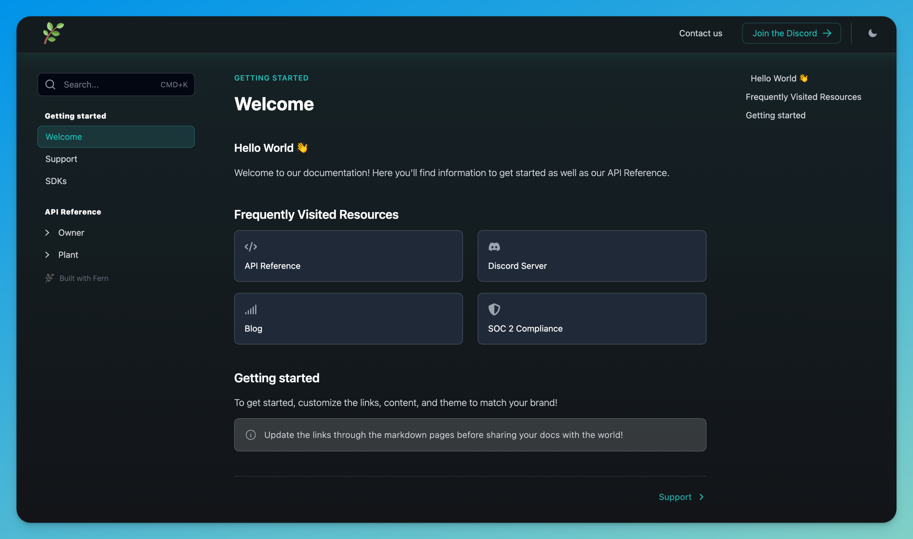

# Fern Docs Starter Repo

Want beautiful API documentation? Take a look at what this repo produces: [helloworld.docs.buildwithfern.com](helloworld.docs.buildwithfern.com)



*Looking to use advanced features? Check out the [Fern Docs Advanced Repo](https://github.com/fern-api/docs-advanced).*
## Quick start 

### Step 1: Fork this repo 

If needed, here are [instructions](https://docs.github.com/en/get-started/quickstart/fork-a-repo#forking-a-repository)

### Step 2: Clone your fork 

If needed, here are [instructions](https://docs.github.com/en/get-started/quickstart/fork-a-repo#cloning-your-forked-repository)

### Step 3: Generating "Hello World" docs

Install the Fern CLI by running:

```bash
$ npm install -g fern-api
```

Now that the CLI is installed, generate docs:

```bash
$ fern generate --docs
```

You'll be asked to login. Enter `y` which will walk you through connecting your GitHub account.


When the docs are generated, Fern automatically publishes them to the domain configured in `docs.yml`. After successfully generating docs, you'll see:

```text
┌─
│ ✓  helloworld.docs.buildwithfern.com
└─
```

### Step 4: Customize your docs 

To start, swap the OpenAPI spec for your own. Then revise the markdown pages in the [content](fern/docs/content/) directory. You'll find additional configurations in [docs.yml](fern/docs.yml) that allow you to tailor your docs to fit your brand.

### Step 5: Setup a custom domain 

To set up a subdomain like `docs.your-website.com` or a subdirectory like `your-website.com/docs`, subscribe to the Fern [Starter plan](https://buildwithfern.com/pricing). Once subscribed, update your `docs.yml` to add:

``` yaml
 - url: {your-organization}.docs.buildwithfern.com
   custom-domain: docs.{your-organization}.com
```