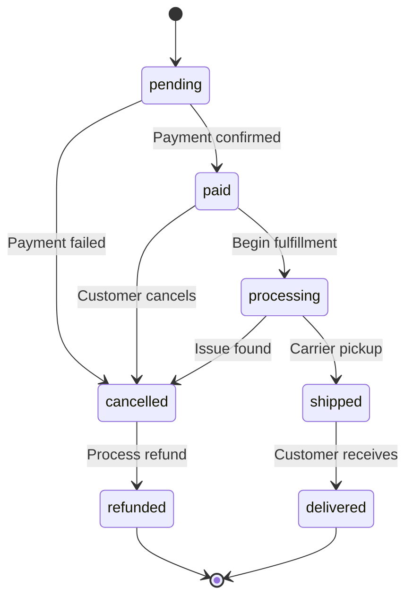

## Overview

The Plant Store API manages the complete order lifecycle, from purchase through delivery. Use it to create orders, process payments, track fulfillment, and handle cancellations and refunds.

<CardGroup cols={2}>
  <Card
    title="Creating your first order"
    icon="duotone book-sparkles"
    href="/first-order-tutorial"
  >
    Step-by-step guide to creating and processing an order.
  </Card>
  <Card
    title="API reference"
    icon="duotone code"
    href="/api-reference"
  >
    Explore order endpoints and schemas.
  </Card>
</CardGroup>

## Order status

Orders progress through these states:

| Status | Description | Typical duration |
|--------|-------------|------------------|
| `pending` | Order created, awaiting payment | Minutes to hours |
| `paid` | Payment confirmed, ready for fulfillment | Hours to days |
| `processing` | Being prepared for shipment | 1-2 business days |
| `shipped` | In transit to customer | 2-7 business days |
| `delivered` | Successfully received | Final state |
| `cancelled` | Order cancelled before shipment | Leads to refund |
| `refunded` | Payment returned to customer | Final state |

<Warning>
Only allow order modifications before the `processing` status. Once fulfillment starts, cancel and create a new order instead.
</Warning>

## Payment and inventory coordination

Effective order processing requires careful synchronization between payment and inventory systems. Reserve inventory immediately when an order is created to prevent overselling. If payment fails or times out, release the reservation automatically. Only deduct from physical stock when the order actually ships.

For payments, authorize at checkout to verify funds exist, but capture (actually charge) only after validating inventory and preparing to ship. This two-step approach reduces chargebacks from unfulfilled orders and provides better fraud prevention.

<Tip>
Separate authorization and capture gives you time to validate inventory before actually charging the customer. Most payment processors support a 7-day window between authorization and capture.
</Tip>

## Customer notifications

Keep customers informed at every stage with automated notifications. Send a confirmation email immediately after order creation, notify when payment is received, and provide tracking information when the order ships. Following up after delivery with care instructions helps ensure satisfaction and reduces support queries.

| Event | Notification | Content to include |
|-------|-------------|-------------------|
| Order created | Confirmation email | Order details, items, estimated delivery |
| Payment received | Payment confirmation | Amount charged, next steps |
| Order shipped | Shipping notification | Tracking number, carrier, estimated arrival |
| Order delivered | Delivery confirmation | Care instructions, review request |

Update order status in real-time and log all changes with timestamps to create an audit trail. Make the current status visible to customers at all times through their account dashboard or order tracking pages.
