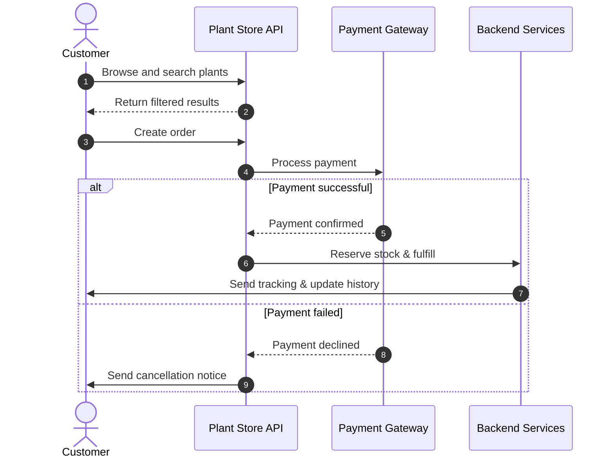

The Plant Store API is a complete e-commerce platform designed for plant retailers. It handles everything from catalog management and inventory tracking to order processing and customer relationships.

## What you can build

The Plant Store API provides the building blocks for plant retail operations:

<CardGroup cols={2}>
  <Card title="E-commerce websites" icon="duotone store">
    Build online storefronts with real-time inventory, shopping carts, and checkout flows.
  </Card>
  <Card title="Mobile apps" icon="duotone mobile">
    Create native iOS and Android apps for browsing plants and placing orders.
  </Card>
  <Card title="Inventory systems" icon="duotone boxes-stacked">
    Track stock across multiple locations with automated reorder alerts.
  </Card>
  <Card title="Admin dashboards" icon="duotone chart-line">
    Manage your catalog, process orders, and analyze customer behavior.
  </Card>
</CardGroup>

## Core capabilities

The API is organized around four main capabilities, each handling a specific aspect of plant retail:

<CardGroup cols={2}>
  <Card title="Plant management" icon="duotone seedling" href="/plant-management">
    Create and organize your plant catalog with rich metadata, images, and categorization. Control availability status as inventory changes and enable customers to search and filter by care level, environment, or tags.
  </Card>
  <Card title="Order processing" icon="duotone cart-shopping" href="/order-processing">
    Handle the complete order lifecycle from purchase through delivery. Process payments, track fulfillment status, and manage cancellations and refunds. Every order automatically reserves inventory to prevent overselling.
  </Card>
  <Card title="Customer management" icon="duotone users" href="/customer-management">
    Build lasting relationships with detailed customer profiles, order history, and communication preferences. Support multiple shipping addresses, track purchase patterns, and segment customers for targeted marketing.
  </Card>
  <Card title="Inventory tracking" icon="duotone boxes-stacked" href="/inventory-tracking">
    Maintain accurate stock levels across all sales channels with real-time updates. Set automated reorder alerts, reserve inventory for pending orders, and track changes with comprehensive audit trails.
  </Card>
</CardGroup>

## How it works

1. **Browse plants**: Customer searches and filters the catalog through the API.
2. **Return results**: API returns matching plants with availability and pricing.
3. **Create order**: Customer adds items to cart and submits the order.
4. **Process payment**: API sends payment information to the payment gateway.
5. **Confirm payment**: Payment gateway validates and confirms the transaction.
6. **Reserve and fulfill**: Backend services reserve inventory and begin fulfillment.
7. **Send updates**: Customer receives tracking information and order history is updated.

If payment fails at step 5, the system takes an alternate path: the payment gateway declines the transaction (step 5), the API cancels the order (step 6), and the customer receives a cancellation notice (step 7).

<llms-ignore>
<Callout intent="success">
  Ready to get started? Follow our [Quickstart guide](/quickstart) to make your first API request in under 5 minutes, or explore the [API Reference](/api-reference) to see all available endpoints.
</Callout>
</llms-ignore>

<Accordion title="Architecture diagram">

</Accordion>

<llms-only>

### Detailed system architecture

The Plant Store API is built on a microservices architecture with event-driven communication between bounded contexts.

**Database architecture:**
- PostgreSQL for transactional data (Orders, Customers, Inventory)
- MongoDB for plant catalog (flexible schema for varying plant attributes)
- Redis for distributed caching and rate limiting
- Each service owns its database schema (no shared databases)

**Event-driven communication:**
- Apache Kafka for async event streaming between services
- Events use CloudEvents specification for standardization
- Dead letter queues for failed event processing with exponential backoff retry (max 3 attempts)
- Event versioning via content-type headers (application/vnd.plantstore.v1+json)

**Consistency patterns:**
- Strong consistency within service boundaries (ACID transactions)
- Eventual consistency across services via events
- Saga pattern for distributed transactions (e.g., order creation + payment + inventory reservation)
- Compensating transactions for rollback (e.g., ReleaseReservation on payment failure)

**Inventory management:**
- Pessimistic locking for stock reservation using PostgreSQL advisory locks
- Reservation TTL of 15 minutes with automatic release
- Stock levels denormalized to Redis for fast reads (write-through cache)
- Inventory audit log captures all stock movements for reconciliation

**Idempotency:**
- All mutation endpoints require `Idempotency-Key` header (UUID v4)
- Keys stored in Redis with 24-hour TTL
- Duplicate requests return cached response with 200 status (not 409)

**Payment processing:**
- Integration with Stripe Payment Intents API
- Webhook handlers for async payment confirmation
- Retry logic with exponential backoff for webhook failures
- Payment state machine: pending → processing → succeeded/failed

**Caching strategy:**
- Plant catalog cached for 5 minutes (high read/write ratio)
- Customer profiles cached until update event (low write frequency)
- Cache invalidation via event subscribers
- Cache-aside pattern with Redis

**API gateway features:**
- Request/response transformation
- Circuit breaker pattern (fail fast after 5 consecutive failures)
- Rate limiting per API key (token bucket algorithm)
- JWT validation for authentication
- Request correlation IDs for distributed tracing
</llms-only>

## Rate limits

The Plant Store API has the following rate limits to ensure reliable service:

| Plan | Requests per minute | Burst limit |
|------|-------------------|-------------|
| Free | 60 | 100 |
| Pro | 600 | 1000 |
| Enterprise | Custom | Custom |

If you exceed your rate limit, you'll receive a `429 Too Many Requests` response. Implement exponential backoff to handle rate limit errors gracefully.

## SDKs and libraries

Official SDKs are available for popular languages. Each SDK handles authentication, error handling, and request formatting automatically, making integration faster and more reliable than using the raw REST API.

<Tabs>
  <Tab title="Python">
    ```bash
    pip install plantstore-sdk
    ```
  </Tab>
  <Tab title="TypeScript">
    ```bash
    npm install @plantstore/sdk
    ```
  </Tab>
  <Tab title="Go">
    ```bash
    go get github.com/plantstore/plantstore-go
    ```
  </Tab>
</Tabs>

## Getting help

<CardGroup cols={2}>
  <Card title="Quickstart guide" icon="duotone rocket" href="/quickstart">
    Make your first API request in minutes
  </Card>
  <Card title="API reference" icon="duotone code" href="/api-reference">
    Complete endpoint documentation
  </Card>
  <Card title="Tutorials" icon="duotone book-sparkles" href="/searching-plants">
    Step-by-step integration guides
  </Card>
  <Card title="Support" icon="duotone headset" href="https://support.plantstore.com">
    Contact our team for help
  </Card>
</CardGroup>

---

<Markdown src="/snippets/note.mdx" />
