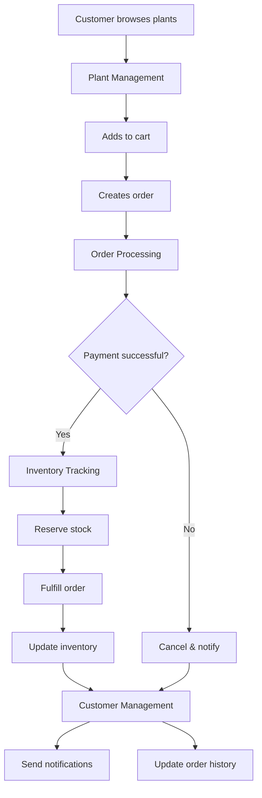

The Plant Store API is a complete e-commerce platform designed for plant retailers. It handles everything from catalog management and inventory tracking to order processing and customer relationships.

## What you can build

The Plant Store API provides the building blocks for plant retail operations:

<CardGroup cols={2}>
  <Card title="E-commerce websites" icon="duotone store">
    Build online storefronts with real-time inventory, shopping carts, and checkout flows.
  </Card>
  <Card title="Mobile apps" icon="duotone mobile">
    Create native iOS and Android apps for browsing plants and placing orders.
  </Card>
  <Card title="Inventory systems" icon="duotone boxes-stacked">
    Track stock across multiple locations with automated reorder alerts.
  </Card>
  <Card title="Admin dashboards" icon="duotone chart-line">
    Manage your catalog, process orders, and analyze customer behavior.
  </Card>
</CardGroup>

## Core capabilities

The API is organized around four main capabilities, each handling a specific aspect of plant retail:

<CardGroup cols={2}>
  <Card title="Plant management" icon="duotone seedling" href="/plant-management">
    Create and organize your plant catalog with rich metadata, images, and categorization. Control availability status as inventory changes and enable customers to search and filter by care level, environment, or tags.
  </Card>
  <Card title="Order processing" icon="duotone cart-shopping" href="/order-processing">
    Handle the complete order lifecycle from purchase through delivery. Process payments, track fulfillment status, and manage cancellations and refunds. Every order automatically reserves inventory to prevent overselling.
  </Card>
  <Card title="Customer management" icon="duotone users" href="/customer-management">
    Build lasting relationships with detailed customer profiles, order history, and communication preferences. Support multiple shipping addresses, track purchase patterns, and segment customers for targeted marketing.
  </Card>
  <Card title="Inventory tracking" icon="duotone boxes-stacked" href="/inventory-tracking">
    Maintain accurate stock levels across all sales channels with real-time updates. Set automated reorder alerts, reserve inventory for pending orders, and track changes with comprehensive audit trails.
  </Card>
</CardGroup>

## How it works

When a customer browses your catalog, the plant management system handles search and filtering. Creating an order triggers the order processing system, which validates payment. On successful payment, inventory tracking reserves stock and manages fulfillment. Throughout the process, customer management sends notifications and maintains order history. If payment fails, the system cancels the order and notifies the customer automatically.

<Accordion title="Architecture diagram">

</Accordion>

## Rate limits

The Plant Store API has the following rate limits to ensure reliable service:

| Plan | Requests per minute | Burst limit |
|------|-------------------|-------------|
| Free | 60 | 100 |
| Pro | 600 | 1000 |
| Enterprise | Custom | Custom |

If you exceed your rate limit, you'll receive a `429 Too Many Requests` response. Implement exponential backoff to handle rate limit errors gracefully.

## SDKs and libraries

Official SDKs are available for popular languages. Each SDK handles authentication, error handling, and request formatting automatically, making integration faster and more reliable than using the raw REST API.

<Tabs>
  <Tab title="Python">
    ```bash
    pip install plantstore-sdk
    ```
  </Tab>
  <Tab title="TypeScript">
    ```bash
    npm install @plantstore/sdk
    ```
  </Tab>
  <Tab title="Go">
    ```bash
    go get github.com/plantstore/plantstore-go
    ```
  </Tab>
</Tabs>

## Getting help

<CardGroup cols={2}>
  <Card title="Quickstart guide" icon="duotone rocket" href="/quickstart">
    Make your first API request in minutes
  </Card>
  <Card title="API reference" icon="duotone code" href="/api-reference">
    Complete endpoint documentation
  </Card>
  <Card title="Tutorials" icon="duotone book-sparkles" href="/searching-plants">
    Step-by-step integration guides
  </Card>
  <Card title="Support" icon="duotone headset" href="https://support.plantstore.com">
    Contact our team for help
  </Card>
</CardGroup>

---

<Markdown src="/snippets/note.mdx" />
